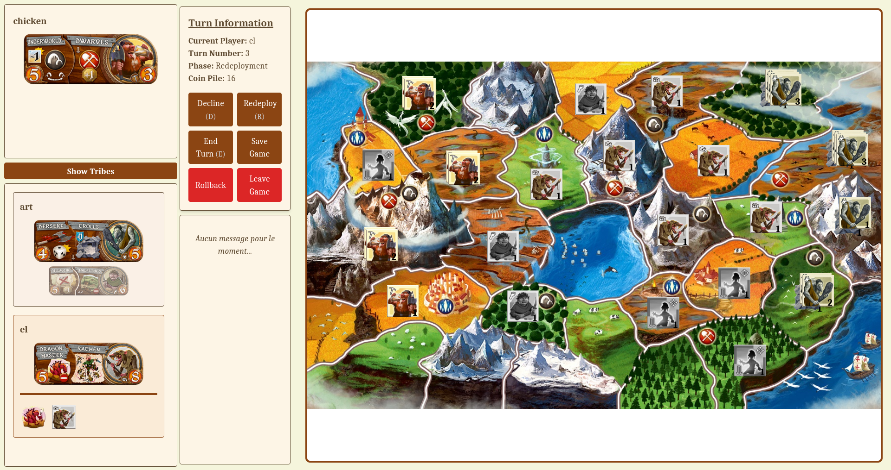
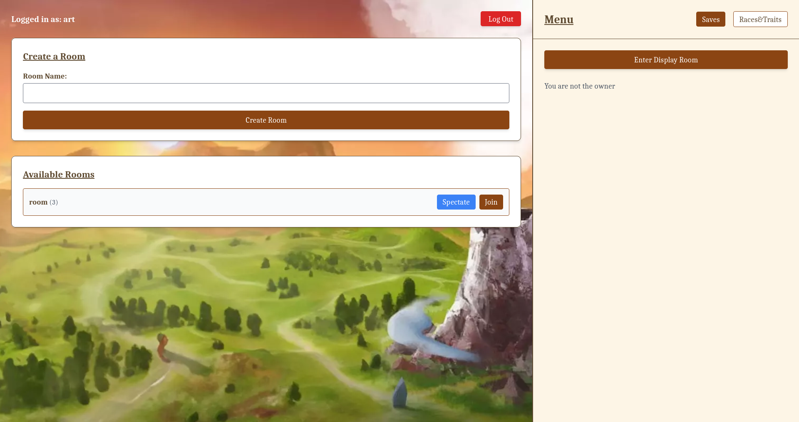
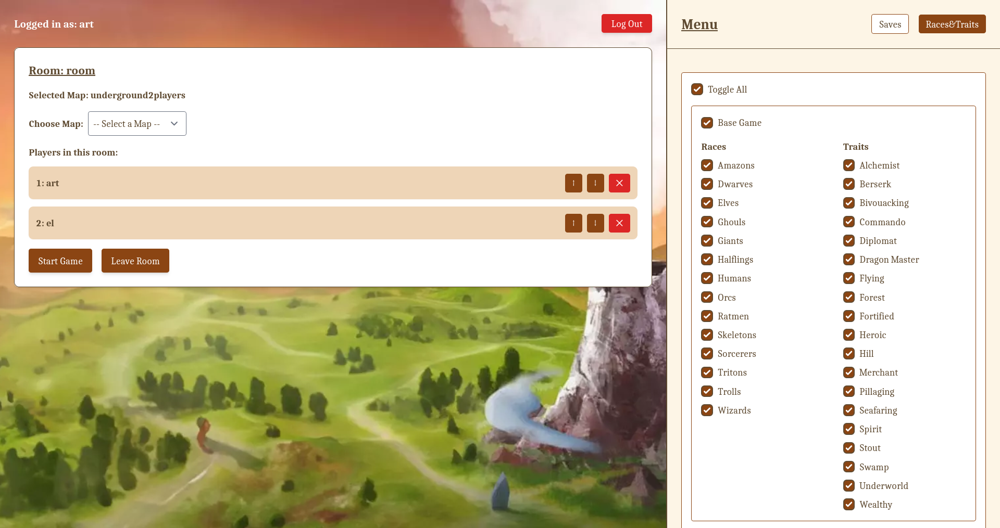
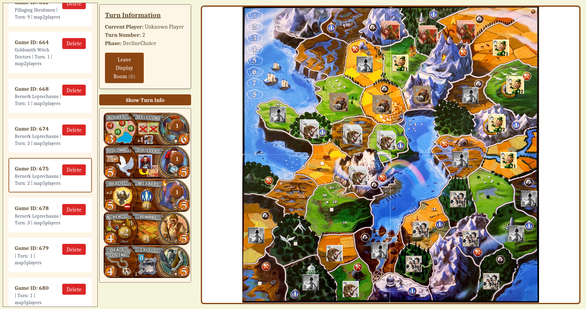
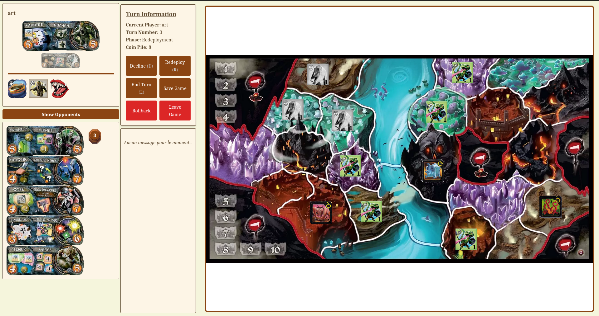

# Smallworld

This is a replica of the board game "Smallworld", built to be played online on a browser, connecting  via websocket to a server. The backend is written in go and the frontend uses React.

Most extensions for the game have been implemented, including "Underground".

## How to run

To run the backend, go to `/backend` and run `go run cmd/server/main.go`. It will by default run on localhost:8080

To run the frontend, go to `/frontend` and run `npm install` and then `npm start`. It will by default run on localhost:3000.

One has to manually set the address of the backend on the frontend by going to `/frontend/src/services/backendServices.ts`, and changing the "socket" variable.
One connect to the UI in the browser, by default on localhost:3000

## Some images

A game with 3 players

Inside the lobby

Inside the lobby, waiting for people to join the game

In the display room, looking at a saved game.

Trying the Underground extension

